# 本文讲述如何在openct主仓库上创建PR

### 首先fork主仓库到自己的github账号中：如下图所示：

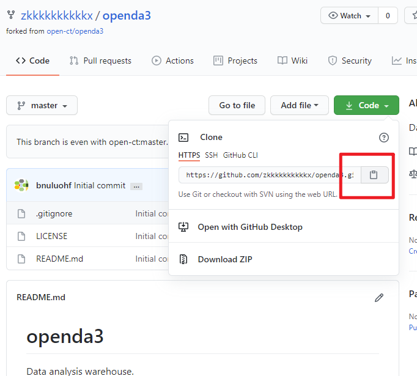

### 将fork过后的仓库clone到本地：

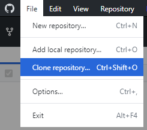

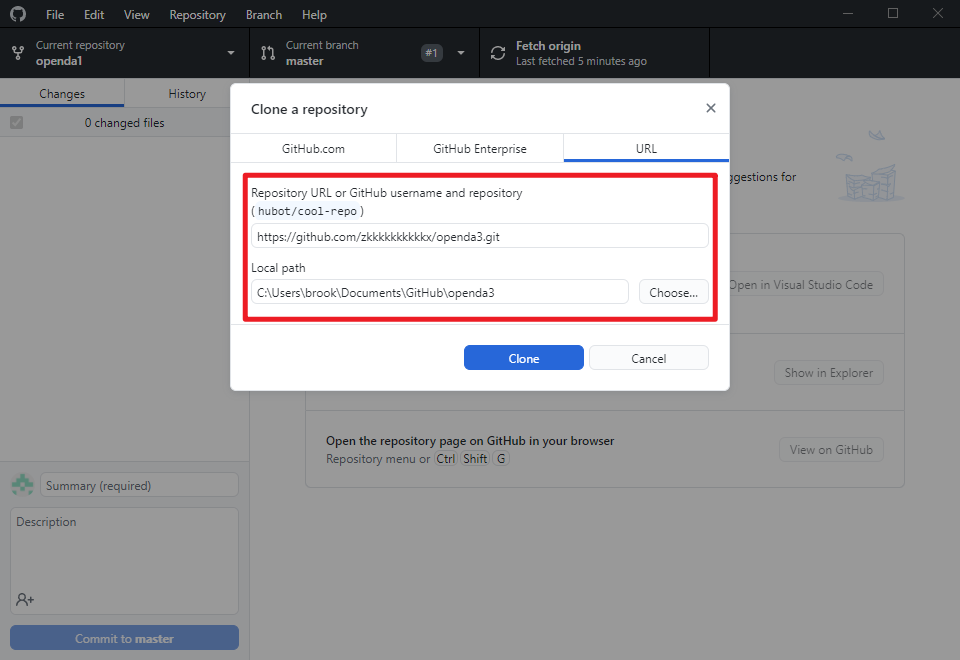

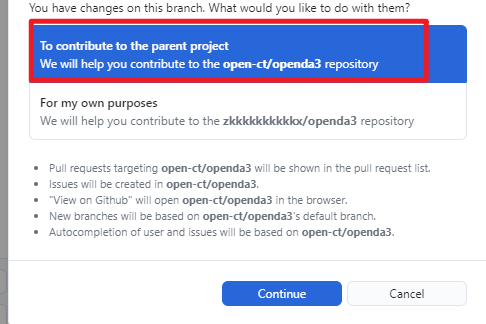

### 在对应位置添加或修改文件

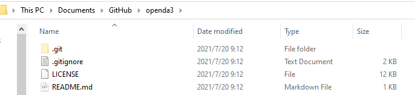

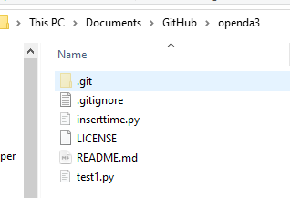

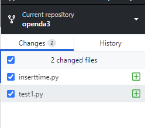

### 在左下角填写commit日志，并点击commit：

### 然后push到仓库中去：

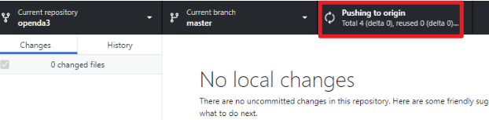

### 此时修改的只是自己fork过后的仓库，不是主仓库：

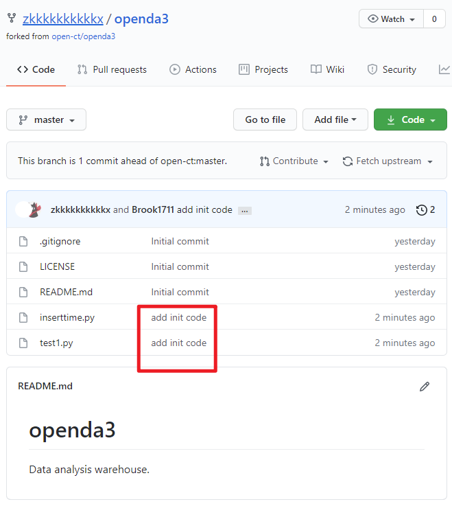

### 在fork仓库中创建PR：

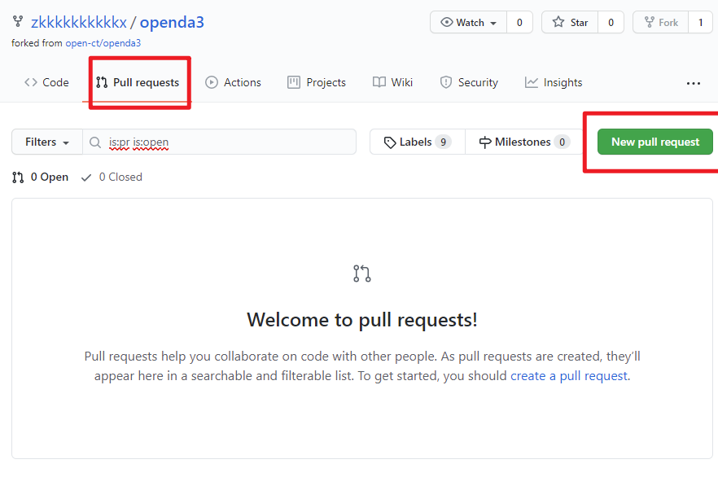

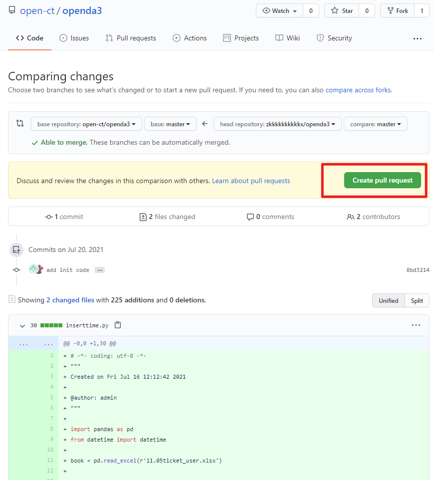

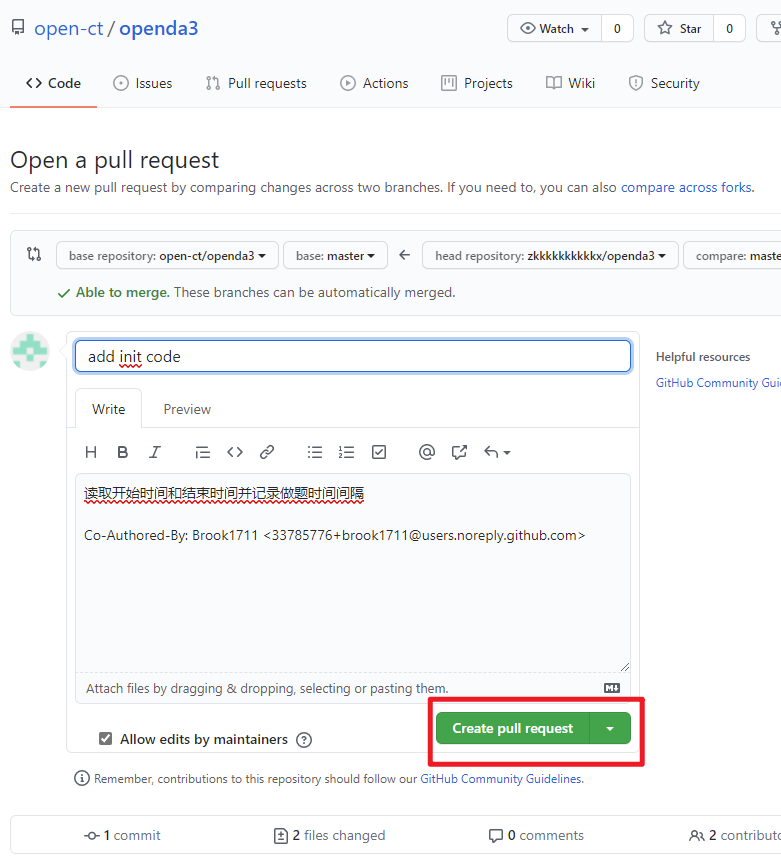

### 提交申请后就可以看到自己的PR，管理员在之后通过审核代码会同意或者拒绝PR

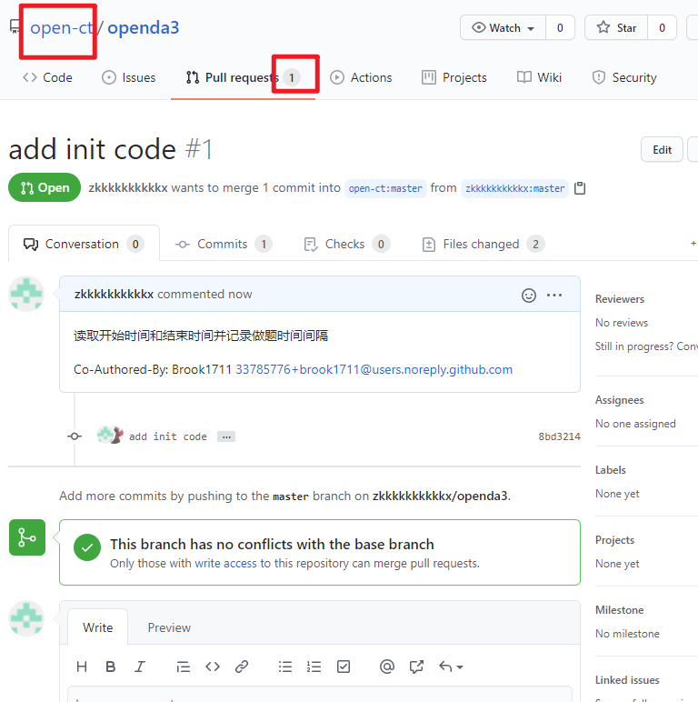